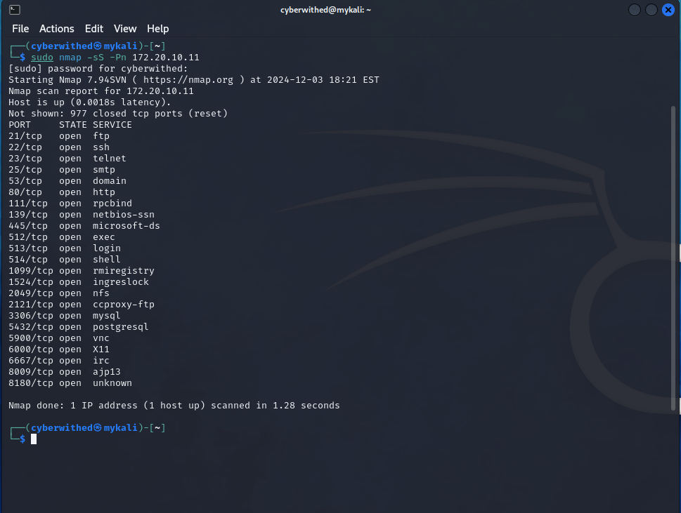
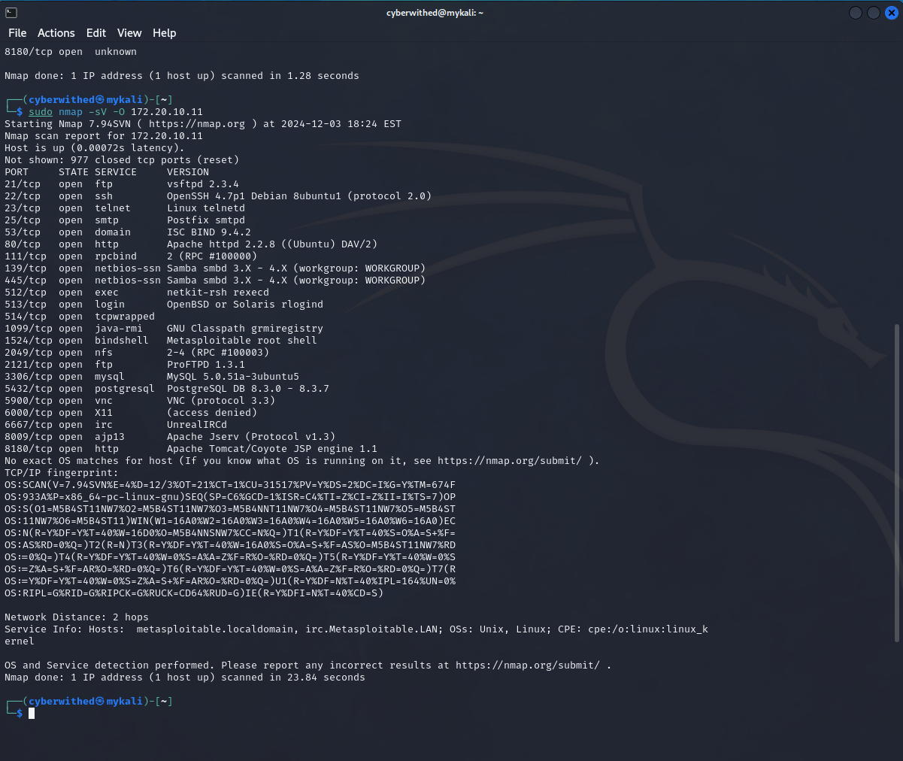
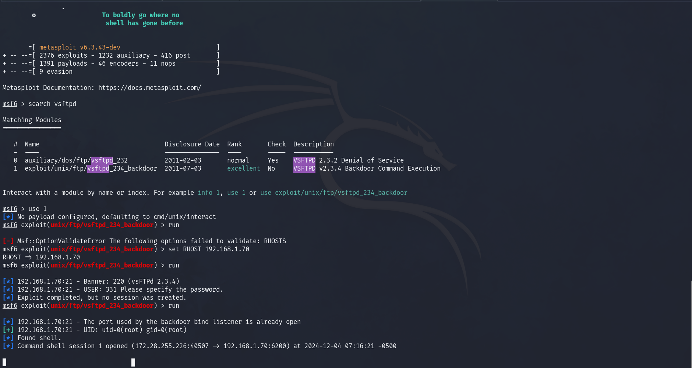

# Penetration-Testing-Project
Objective:
To perform a penetration test on the target system, identify vulnerabilities, exploit them, and document the process for learning and portfolio purposes.

Target Information:

    IP Address: 172.28.10.11
    OS: Linux (Metasploitable 2)
    Services Detected: FTP, SSH, Telnet, Smtp, Domain, Http, Rpcind, Netbios-SSN, Microsoft-ds,Exec, Login, Shell, Rmiregistry,Ingreslock,NFS, Ccproxy-ftp, Mysq, Postgresql, Vnc, X11, IRC, ajp13

# Project Description
This project demonstrates a full penetration testing workflow conducted on the intentionally vulnerable Metasploitable 2 virtual machine. The project covers reconnaissance, exploitation, and post-exploitation steps, showcasing practical skills in vulnerability identification and exploitation.
 <b>Current Progress:</b> 
Reconnaissance: Scanned open ports and identified services running on the target using nmap. 
  

Exploitation: Successfully exploited a vulnerability in vsftpd 2.3.4 to gain shell access using Metasploit. 

Post-Exploitation: Extracted password hashes from /etc/shadow and initiated password cracking using John the Ripper.

# Technologies Used

# Steps or Features 

# Sample Output 

